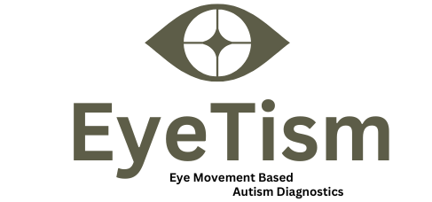

# EyeTism - Eye Movement Based Autism Diagnostics
##### Authors: Elena Ockfen, Dennis Dombrovskij, Mariano Santoro, Stefan Schlögl, Adam Zabicki
----

This Github repository contains only the Streamlit dashboard, which is hostet on the streamlit cloud and can be accessed anytime at [eyetism.streamlit.app](https://eyetism.streamlit.app).

The complete work of the Capstone project "EyeTism - Eye Movement Based Autism Diagnostics" can be viewed in our [**EyeTism repository**](https://githubu.com/eockfen/eyetism).

# About

Our "EyeTism" project focussed on the development of a tool for diagnosis of Autism Spectrum Disorder (ASD) in children within the age range of 8 - 15 years old. ASD is a developmental disability with effects on social interaction and learning. Hence, early diagnosis of affected children is crucial for child development. Although individuals with ASD often exhibit distinct gaze behavior compared to typically developing (TD), ASD detection still remains challenging. Our tool employs machine learning on eye tracking data from high-functioning ASD and TD children to build an integrative tool for pediatricians responsible for diagnosing ASD based on visual attention patterns of patients on a selected subset of images. 

# Dashboard

To showcase the basic functionality of our diagnostic tool, we've constructed a Streamlit application. If you're inclined towards practical demonstrations rather than delving into intricate code details, this application is tailor-made for you. Feel free to explore and experience the practical side of our project!
